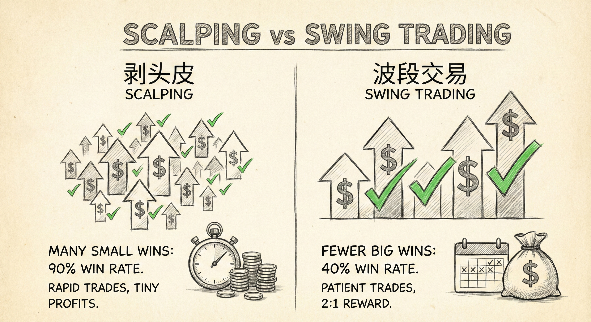
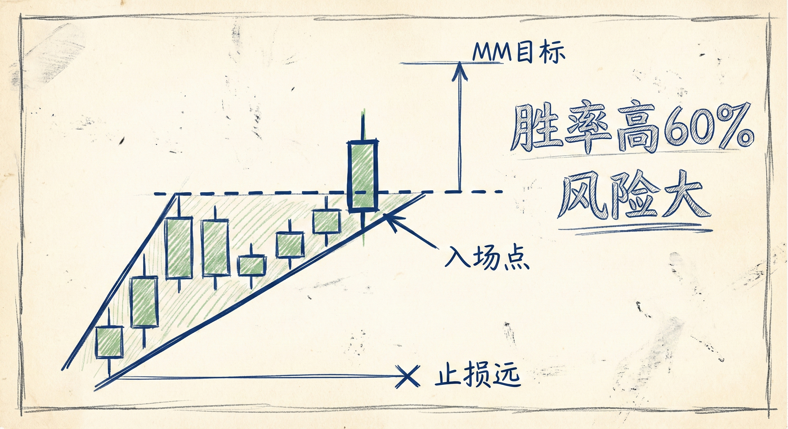
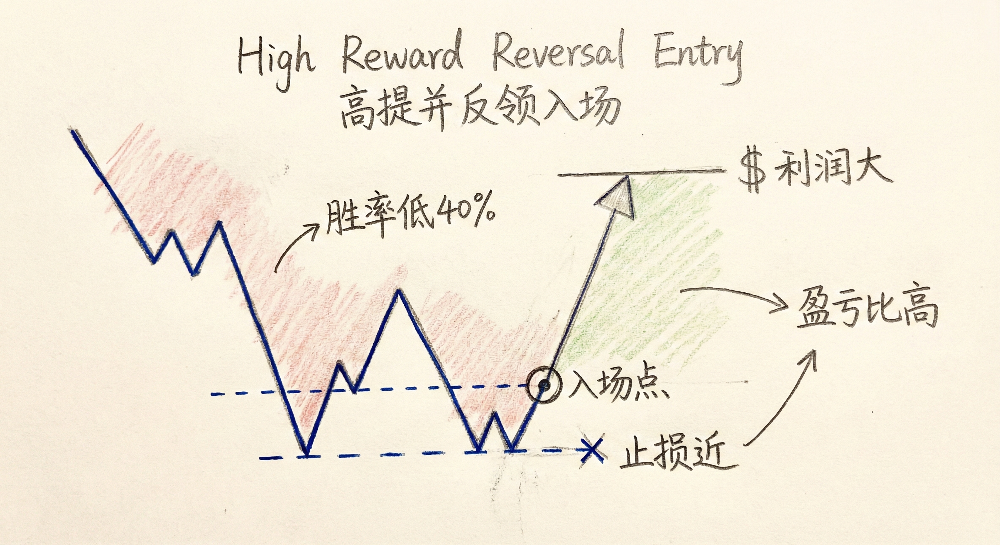
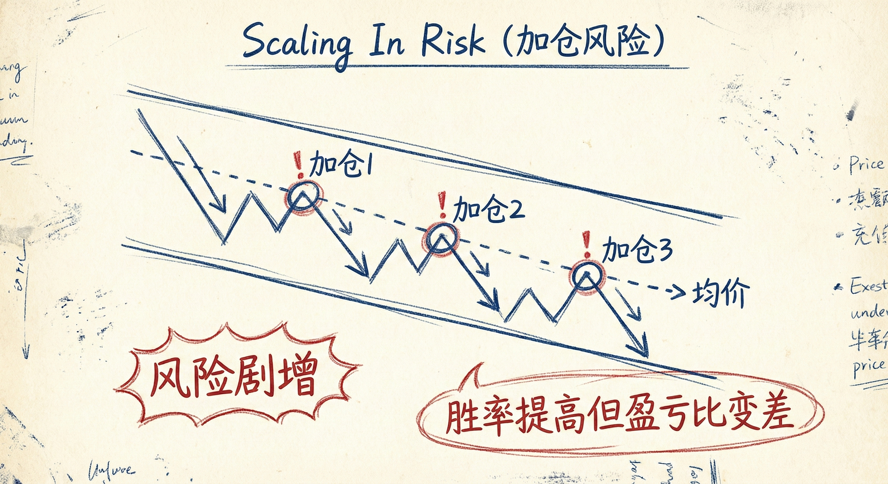

# 数学期望与概率（第二部分）

## 概率、风险与利润的权衡 (The Trade-off)

### 核心变量与关系
-   **交易的三要素**：交易者不能只关注风险（Risk）和利润（Reward），必须引入第三个关键变量——**概率 (Probability)**。
-   **不可兼得定律**：不存在完美的交易。
    -   **高胜率**：通常伴随着较差的盈亏比（风险大，利润小）。
    -   **高盈亏比**：通常伴随着较低的胜率（经常亏损）。
-   **市场博弈本质**：每一笔交易都有买方和卖方。一方可能追求高胜率，另一方可能追求高盈亏比。只要管理得当，双方都是理性的且都能盈利。

### 交易风格分类
-   **剥头皮 (Scalping)**：
    -   **特征**：追求极高的胜率（如90%）。
    -   **代价**：盈亏比很差，通常利润等于或小于风险。
    -   **逻辑**：通过高频的小额盈利积累财富，必须维持高胜率才能生存。
-   **波段交易 (Swing Trading)**：
    -   **特征**：追求高盈亏比（利润通常是风险的2倍以上）。
    -   **代价**：胜率较低（通常40%-50%）。
    -   **逻辑**：能够容忍频繁的小亏损，依靠偶尔的大幅盈利来覆盖亏损并获利。
-   **彩票/赌博案例**：彩票拥有极致的盈亏比（1美元博取数亿），但胜率趋近于零。这不是交易，因为数学期望由庄家控制（庄家拥有100%的赚钱概率）。

## 入场位置与概率分析

### 顺势突破入场 (High Probability)
-   **场景**：在大阳线突破、强趋势跟随或测量目标位（MM）预期明确时入场。
-   **优势**：胜率高（60%以上），市场惯性强。
-   **劣势**：**风险大**。止损通常需要放在趋势起点或突破K线底部，距离现价很远。
-   **结论**：此类交易者用承担更大的风险来换取更高的胜率。

### 逆势/回调极值入场 (High Reward)
-   **场景**：在双底、深幅回调、震荡区间边界或弱势反转信号下方逆势入场。
-   **优势**：**风险非常小**。止损紧贴极值点（如双底下方），潜在利润空间巨大（极佳的盈亏比）。
-   **劣势**：胜率低。大部分尝试会失败（被止损），或者市场陷入震荡。
-   **结论**：此类交易者用低胜率换取极高的盈亏比。

## 提升概率的高级手段与陷阱

### 加仓 (Scaling In)
-   **操作**：在初始仓位亏损时（如在下降通道中做多，价格继续下跌时）继续加仓。
-   **效果**：通过拉低均价，显著**提高胜率**（只需小幅反弹即可打平或微赚离场）。
-   **代价**：**风险剧增**，且盈亏比变差。如果趋势未反转，亏损将成倍增加。
-   **警告**：新手不应尝试，这需要极强的资金管理能力和经验。

### 趋势中的位置判断
-   **回调深度影响**：
    -   **浅回调**：趋势延续概率高，但止损远（盈亏比差）。
    -   **深回调 (如50%以上)**：趋势延续概率下降（接近50%），但止损变近（盈亏比变好）。
-   **关键点位测试**：强趋势反转测试起点时（如大跌测试前期大涨起点），通常会略微跌破起点制造困惑。这是多空博弈的关键点：
    -   **多头**：视为双底，风险小，盈亏比高。
    -   **空头**：视为趋势反转，胜率随跌破加深而提高，但追空风险也随之增大。

## 总结原则
-   **明确已知与未知**：进场时，风险（止损距离）和利润（目标位）是已知的，唯独**概率**是模糊的，但必须估算。
-   **数学期望为正**：无论是做“高胜率+低盈亏比”还是“低胜率+高盈亏比”，只要数学期望为正，都是合理的策略。
-   **选择适合的风格**：交易者需根据自己对风险的承受力和对胜率的偏好（喜欢经常赢的快感，还是喜欢偶尔大赚的耐心）来选择策略。
