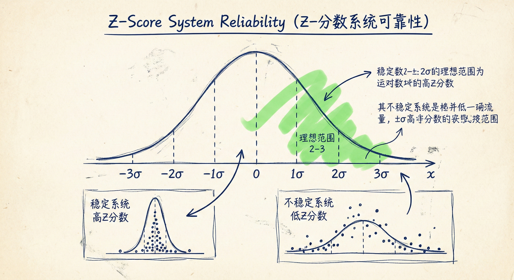
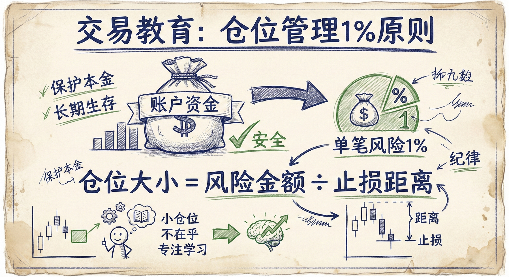
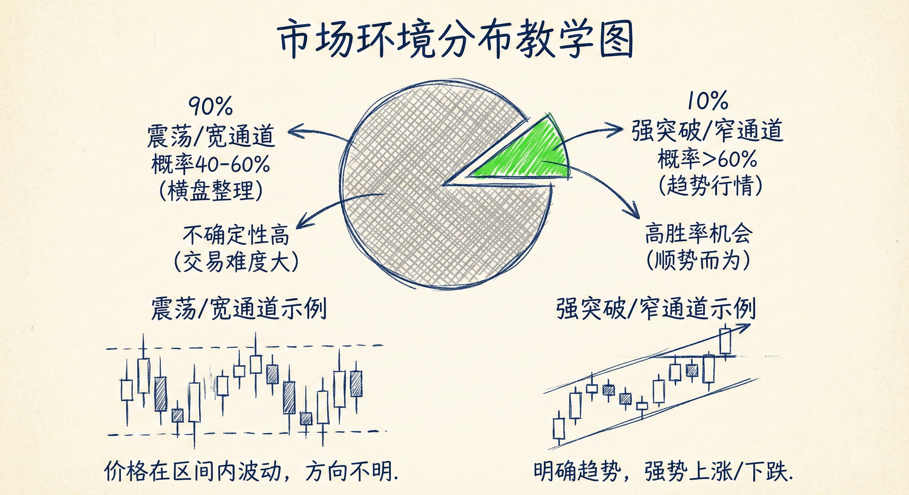
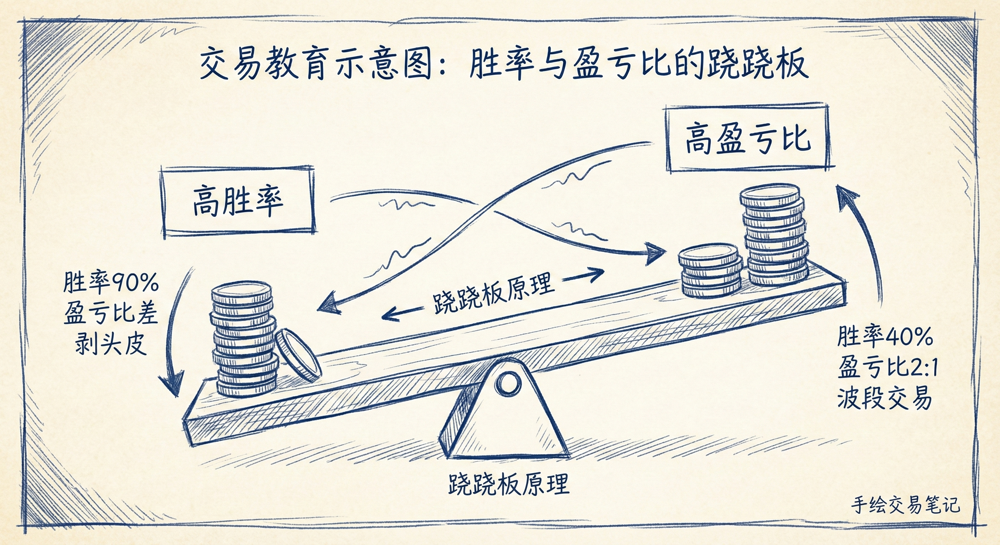

# 数学期望与概率（第三部分）

## Z分数 (Z-Score) 与系统评估

### 定义与意义
-   **概念**：Z分数是衡量交易策略可靠性和盈利能力的数学指标，反映了交易结果偏离平均值的标准差。
-   **判别标准**：
    -   **高 Z 分数**：意味着交易系统胜率高、收益稳定（如剥头皮策略），长期稳定盈利的机会大，爆仓风险小。理想范围在 2~3 之间，极少数优秀交易者能达到 5。
    -   **低 Z 分数**：意味着系统不可靠，爆仓风险高。

### 警惕"一次暴富"型系统
-   **特征**：绝大多数交易亏损或微利，系统的整体盈利完全依赖于极少数的一两次“大赚”交易。
-   **风险**：
    -   **错过关键交易**：如果因故（如生病、度假、心理崩溃）错过了那一笔大赚的交易，整个系统就会变成亏损。
    -   **标准差过大**：收益极其不稳定，心理压力巨大，难以坚持。
-   **结论**：任何需要依赖一两次大赚才能扭亏为盈的系统都是糟糕的系统，新手应避免使用。

## 仓位管理与新手建议

### “不在乎”的仓位 (I Don't Care Size)
-   **核心理念**：使用极小的仓位进行交易，小到即使亏损也不会产生任何心理波动。
-   **目的**：消除金钱恐惧，专注于交易过程的正确性（计划、入场、管理、离场），而非账户余额的增减。
-   **具体操作**：
    -   **1% 风险原则**：每笔交易的风险不应超过账户总资金的 1%。例如 1 万美元账户，单笔风险控制在 100 美元以内。
    -   **调整手数**：根据止损距离调整交易手数。在外汇中，可以通过降低杠杆/手数来适应较宽的止损，保持风险金额恒定。

### 学习成本
-   新手必然会经历亏损，小仓位交易能将"学费"降至最低，从而在市场上存活足够长的时间以积累经验。

## 概率、风险与回报的权衡

### 市场环境与概率分布
-   **90% 的时间（震荡/宽通道）**：市场处于不确定状态，上涨或下跌的概率都在 40%~60% 之间。此时交易充满不确定性。
-   **10% 的时间（强突破/窄通道）**：市场处于明确的趋势中，顺势方向的概率超过 60%。这是高胜率的交易机会。

### 等距离移动概率 (Probability of Equidistant Moves)
-   **定义**：比较价格先触及止盈目标（如上涨 X 点）还是先触及止损（如下跌 X 点）的概率。
-   **趋势中的应用**：
    -   在强趋势（单边行情）中，价格顺势移动 1 倍止损距离的概率通常大于 60%。
    -   此时，即使盈亏比仅为 1:1（利润 = 风险），由于胜率高（>60%），数学期望依然为正，是合理的交易。

### 胜率与盈亏比的跷跷板
-   **高胜率交易**：通常伴随着较差的盈亏比（如剥头皮，利润较薄）。必须给对手盘一个参与的理由（即对手盘虽然胜率低，但盈亏比极高）。
-   **高盈亏比交易**：通常伴随着较低的胜率（如捕捉反转）。
-   **新手误区**：
    -   **不敢入场**：在强趋势中，由于止损距离较远（风险看起来大），新手往往不敢入场，从而错过了高胜率机会。
    -   **逆势操作**：在强趋势中过早押注反转，或在震荡区间高位追涨。

## 总结原则
-   **追求稳定性**：优秀的交易系统依赖于稳定的胜率和收益分布，而非偶尔的暴利。
-   **生存第一**：新手应使用“不在乎”的微小仓位，专注于磨练技术而非赚钱。
-   **识别高胜率时刻**：当市场出现强突破（10%的情况）时，概率向顺势方倾斜（>60%），此时 1:1 的盈亏比足以产生利润。
-   **数学期望为正**：不需要追求完美，只要基于合理的概率和盈亏比，确保长期数学期望为正即可。
