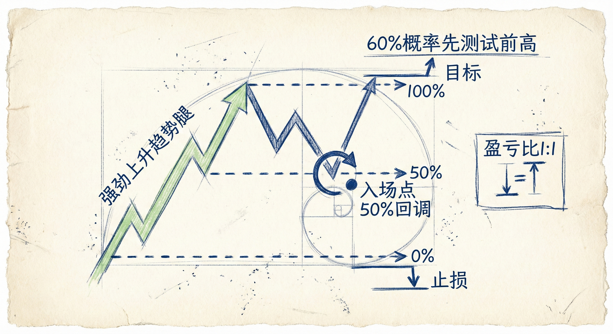
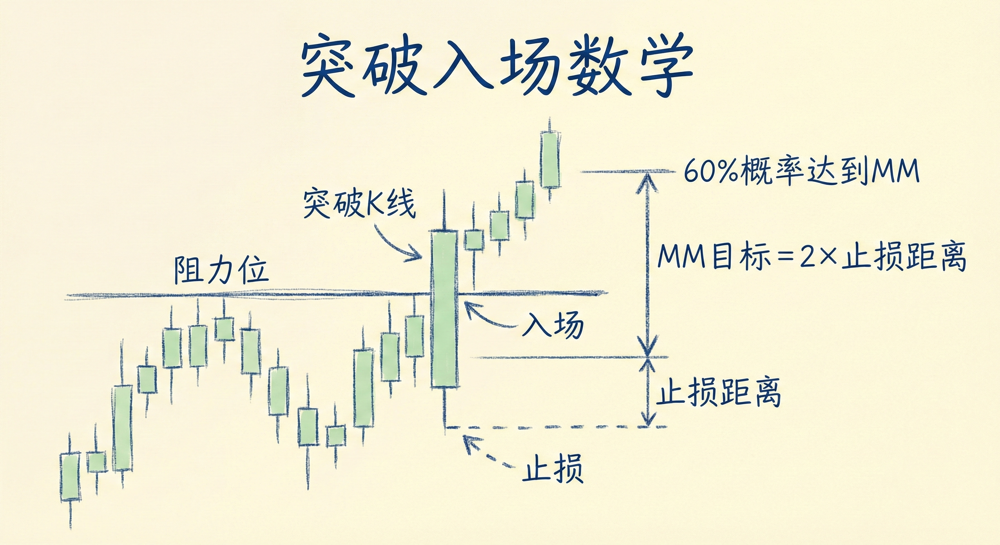
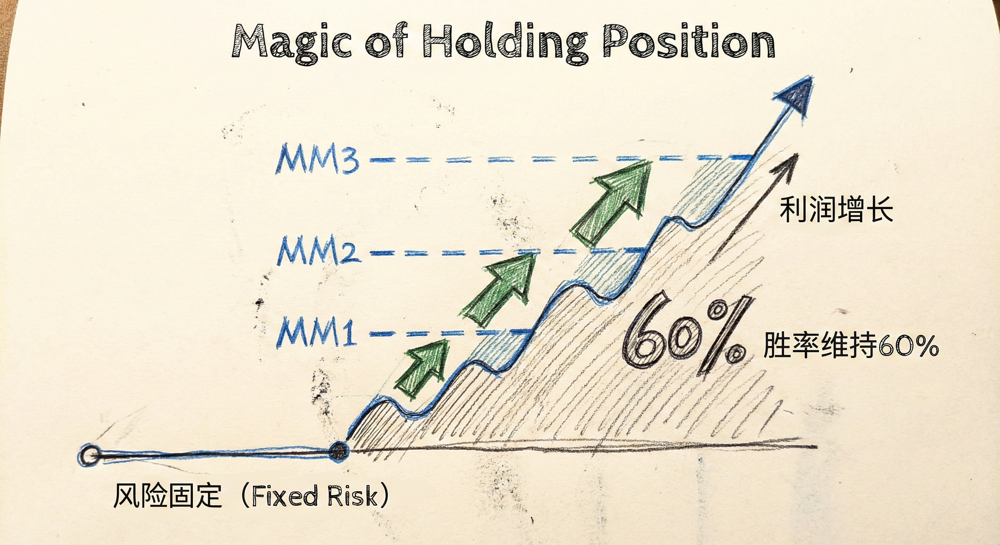
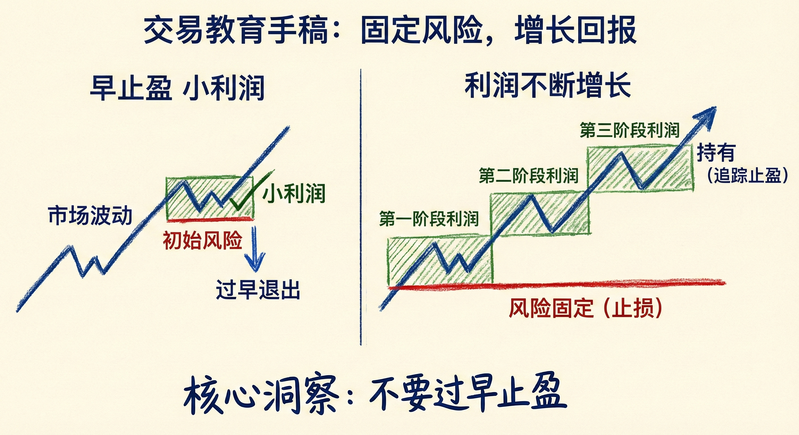

# 数学期望与概率（第四部分）

## 强趋势中的 50% 回调 (50% Pullbacks in Strong Trends)

### 定义与概率逻辑
-   **基本概念**：在强劲的上涨或下跌趋势中，当价格回调/反弹幅度达到50%时，是高概率的顺势入场点。
-   **概率优势**：
    -   **60% 规则**：在强趋势的50%回调处入场，有60%的概率市场会先去测试前期的极值（前高或前低），而不是先回到趋势的起始点打掉止损。
    -   **止损与止盈**：止损通常设在趋势波段的起始点外，止盈设在前期极值。
    -   **数学期望**：此时利润空间（Reward）通常等于风险空间（Risk），即盈亏比约为 1:1。但由于胜率高达60%，因此数学期望（Trader's Equation）为正。

### 交易策略与执行
-   **入场方式**：
    1.  **限价单**：直接在50%回调位挂限价单（需预留少量缓冲空间以确保成交）。
    2.  **反转信号**：等待回调后的反转K线或第2入场点（如上涨中的H2，下跌中的L2）确认后入场。
-   **多头陷阱/空头陷阱**：在强趋势中，即使回调看起来很凶猛（如大阴线回调），只要未破坏趋势结构且在50%附近，往往是诱导新手逆势操作的陷阱，实则是顺势交易者的良机。

### 为什么这是好交易？
-   **胜率弥补盈亏比**：即使盈亏比只有 1:1，只要胜率显著高于50%（如60%），长期交易就是盈利的。
-   **明确的参照点**：止损点（趋势起点）和目标点（趋势极值）清晰明确。

## 突破交易的数学期望 (Math of Breakouts)

### 突破入场的逻辑
-   **强突破特征**：连续的强趋势K线，收盘价接近极值，且收盘价突破了过去数十根K线的极值。
-   **概率优势**：
    -   在强突破K线的收盘价入场（买入或卖出），有60%的概率价格会继续运行至少一个"测量目标位"（Measured Move）。
    -   **测量目标位计算**：通常基于当前收盘价到止损点（突破起点或K线极值）的距离，向趋势方向翻一倍。

### 持仓的数学魔力 (The Math of Holding)
-   **动态期望值提升**：随着突破的延续，早期入场并持有的交易者数学期望会越来越好。
    -   **风险固定**：初始止损通常保持不变（在突破起点），因此风险（Risk）是固定的且较小。
    -   **利润增长**：随着价格不断向趋势方向突破，基于当前价格计算的潜在测量目标位不断上移/下移，潜在利润（Reward）不断增大。
    -   **胜率保持**：只要趋势保持强劲，每一根新K线收盘后，达到新测量目标的概率依然维持在60%左右。
-   **结论**：在强突破中持有仓位，意味着用**不变的低风险**博取**不断增长的高利润**，且**胜率始终维持高位**。

### 交易启示
-   **敢于追涨杀跌**：在真正的强突破中，在K线收盘价入场（Stop entry or Market entry at close）是数学上合理的。
-   **不要过早止盈**：由于随着趋势延伸，数学期望在优化，过早离场会放弃高概率的利润增长机会。
-   **关注MM目标位**：市场常在达到测量目标位（MM Target）后出现反弹或回调，这是部分交易者止盈离场导致的。

## 总结原则
-   **利用50%回调**：强趋势中，50%回调提供了胜率60%、盈亏比1:1的优质入场机会。
-   **理解突破数学**：强突破后的顺势交易具有高胜率；随着趋势发展，持仓的风险回报比会动态优化。
-   **正数学期望**：无论是回调交易还是突破交易，核心在于寻找胜率与盈亏比组合能产生正数学期望（Positive Expectancy）的机会。
