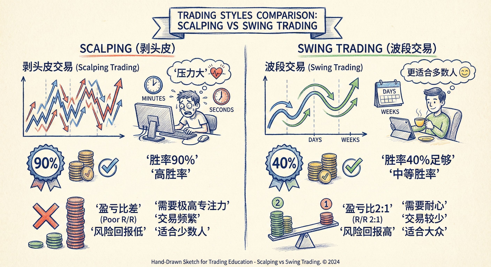
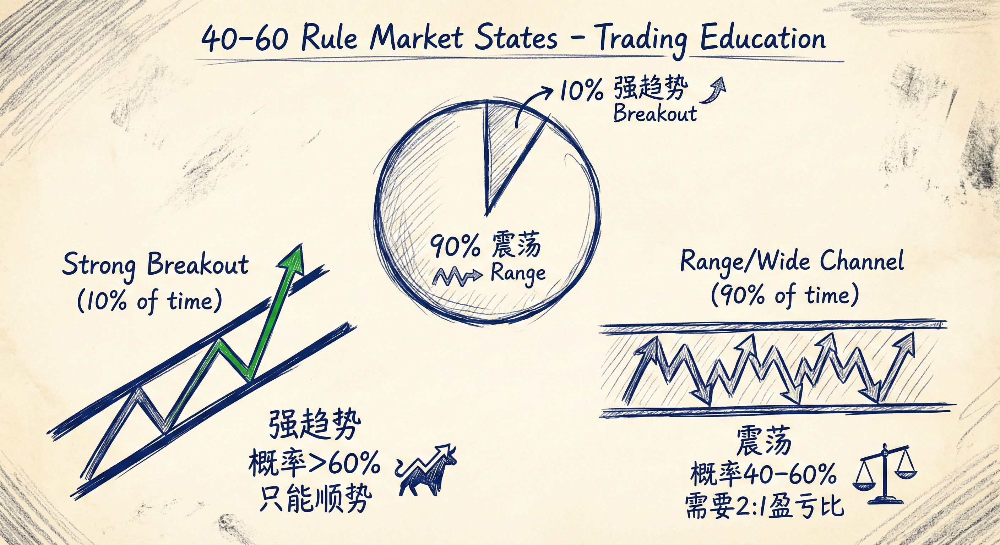
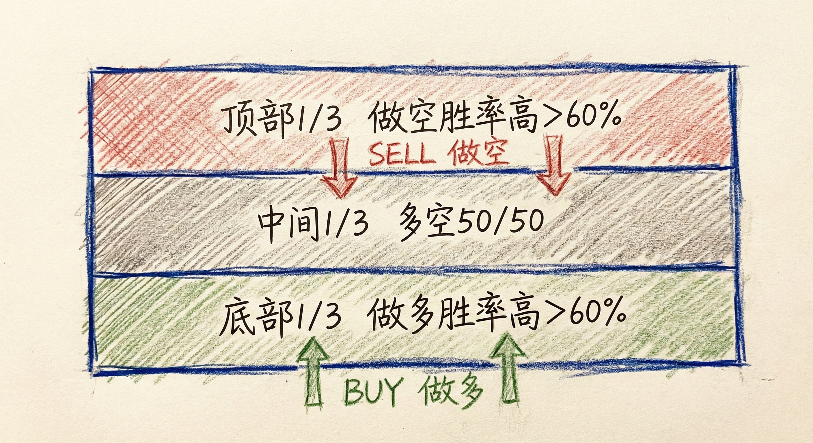
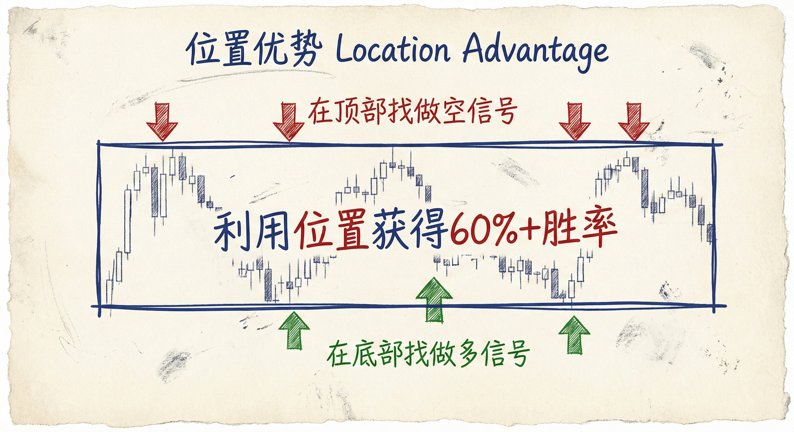

# 数学期望与概率 (第五部分)

## 交易中的确定性悖论

### 90% 把握的时刻
-   **场景**：当市场价格触及你的限价止盈单，但尚未成交（需要再多走1个tick才能成交）。
-   **风险与回报**：此时为了赚取最后1个tick的利润，交易者往往冒着初始止损（可能10-20个ticks）的风险继续持有。
-   **数学含义**：只有当你确信市场有90%的概率会先达到目标位而不是打掉止损时，继续持有才是理性的。这说明交易者在某一瞬间必须对市场走势有极高的信心。

## 剥头皮 vs. 波段交易

### 剥头皮 (Scalping)
-   **特征**：利润目标小，通常风险大于利润（盈亏比差）。
-   **胜率要求**：必须拥有极高的胜率（70%-90%）才能维持数学期望为正。
-   **难度**：虽然复盘看机会很多，但在实盘中很难长期稳定执行，压力巨大，不适合大多数交易者。

### 波段交易 (Swing Trading)
-   **特征**：追求利润至少是风险的2倍（盈亏比好）。
-   **胜率要求**：只需要40%的胜率即可实现盈利。
-   **优势**：这是大多数交易者实现稳定盈利的最佳途径。即使胜率不高，良好的盈亏比也能保证正的数学期望。

## 40-60 法则 (The 40-60 Rule)

### 市场状态分类
-   **强趋势/突破 (10%的时间)**：
    -   概率：顺势方向的概率超过60%。
    -   策略：只能顺势交易（只做多或只做空）。
-   **通道或震荡区间 (90%的时间)**：
    -   概率：无论做多还是做空，胜率都在40%到60%之间（不确定性高）。
    -   策略：既然胜率难以超过60%，必须通过追求“利润 >= 2倍风险”来获利。
    -   **期权市场的佐证**：平价（ATM）看涨期权和看跌期权的价格通常非常接近，证明机构认为市场上涨或下跌的概率在大部分时间是均等的（接近50/50）。

### 交易启示
-   **不要追求完美胜率**：在90%的K线中，不要指望有极高的确定性。
-   **资金管理是关键**：在概率模糊（40-60%）的区域，依靠合理的止损和止盈设置（2:1 盈亏比）来战胜市场。

## 震荡区间内的概率分布

### 区域划分与胜率
-   **顶部 1/3**：做空胜率高（>60%），做多胜率低。
-   **底部 1/3**：做多胜率高（>60%），做空胜率低。
-   **中间 1/3**：多空胜率约为50/50。

### 交易策略
-   **高抛低吸**：在顶部区域寻找做空信号，在底部区域寻找做多信号。
-   **快进快出**：震荡区间内适合剥头皮，因为波段延续性差。
-   **概率优势**：利用位置优势（Location）来获得超过60%的胜率。

## 总结原则
-   **首选波段交易**：对于大多数人，追求2倍风险的利润比追求高胜率更现实。
-   **理解概率限制**：接受市场在90%的时间里是不确定的（40-60%概率），不要在非强趋势期盲目自信。
-   **执行力至上**：交易不仅仅是识别形态（大家都懂），更在于实盘中的管理和执行。即使是零和游戏（短期），优秀的管理也能让你超越平均水平。
