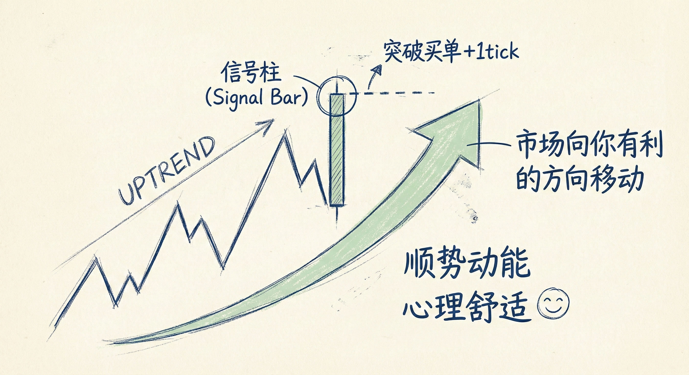
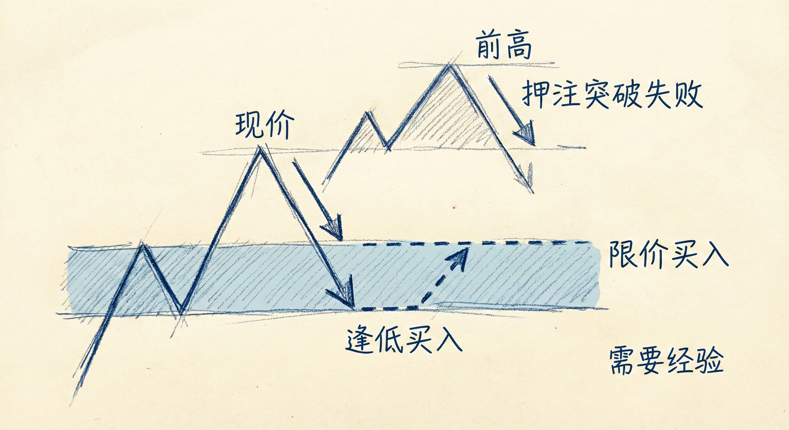
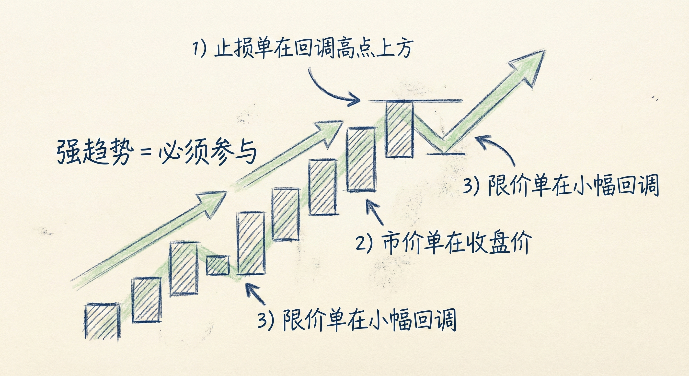
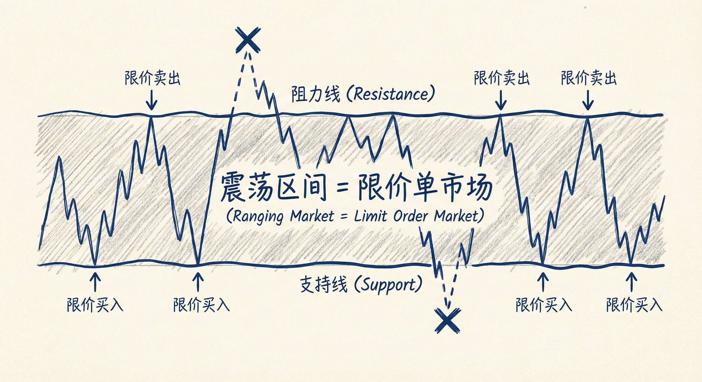

# 订单类型与入场策略

## 突破单 (Stop Orders / Breakout Orders)

### 定义与操作
-   **概念**：在信号K线的高点上方（做多）或低点下方（做空）挂单。
-   **设置细节**：
    -   **外汇**：挂在信号K线极值外 1个 pip。
    -   **股票/期货**：挂在信号K线极值外 1个 tick。
-   **成交逻辑**：只有当市场朝预定方向移动并突破信号K线时，订单才会成交。

### 交易优势
-   **顺势动能**：成交的前提是市场正在向你的方向移动，这略微增加了盈利的概率。
-   **心理舒适**：被市场“带入”交易（顺风车），心理上更容易接受。
-   **适用人群**：**新手**及大多数交易者。新手应只使用突破单入场。

### 局限性
-   **震荡区间失效**：在窄震荡区间中，突破往往失败。在区间顶部买入或底部卖出（追涨杀跌）会导致亏损。

## 限价单 (Limit Orders)

### 定义与操作
-   **概念**：在当前价格下方买入，或在当前价格上方卖出。
-   **操作逻辑**：
    -   **逢低买入**：在K线低点、前期低点挂买单。
    -   **逢高卖出**：在K线高点、前期高点挂卖单。
-   **对手盘关系**：限价单通常是突破单的对手盘（突破单押注突破成功，限价单押注突破失败）。

### 交易含义
-   **押注突破失败**：在震荡区间或弱趋势中，押注价格突破前一根K线或关键位会失败并反转。
-   **剥头皮 (Scalping)**：常用于震荡区间内的短线交易，高抛低吸。
-   **风险管理要求高**：
    -   **宽止损**：需要设置较远的止损点。
    -   **加仓策略**：往往需要在价格不利时（如更低位买入）加仓以摊薄成本。
-   **适用人群**：**经验丰富的交易者**。新手难以处理逆势持仓的心理压力和资金管理。

## 市价单 (Market Orders)

### 定义与应用
-   **概念**：以当前市场价格立即成交。
-   **应用场景**：
    -   **强趋势**：当趋势极强，回调很浅或没有回调时，直接市价入场。
    -   **买/卖收盘 (Buying/Selling Closes)**：在强力趋势K线收盘的瞬间入场，押注动能延续。

## 市场环境与订单匹配

### 强趋势行情 (Strong Trend)
-   **策略**：**只能顺势交易**。
-   **订单选择**：所有类型订单均可。
    -   **突破单**：在回调高点/低点入场。
    -   **市价单**：直接追入。
    -   **限价单**：在微小回调中挂单入场。
-   **关键**：必须参与趋势，入场方式次之。

### 震荡区间 (Trading Range)
-   **策略**：**限价单市场**。逢低买入，逢高卖出。
-   **陷阱**：突破单在此环境中胜率极低（容易买在最高，卖在最低）。
-   **机构行为**：机构倾向于在区间边缘逆势操作（Fade），并利用加仓策略获利。

### 窄震荡区间 (Tight Trading Range)
-   **特征**：K线重叠，影线多，方向不明。
-   **策略**：纯粹的限价单市场。
-   **建议**：**新手应完全避免在此交易**。

## 风险管理与总结原则

### 括号单 (Bracket Orders)
-   **入场即保护**：入场同时应设置止损单（Stop Loss）和止盈单（Profit Target）。
-   **盈亏比**：大多数交易应追求至少 **两倍于初始风险** 的利润。

### 总结
-   **新手原则**：始终使用 **突破单 (Stop Orders)**，只在趋势明朗时交易，避开震荡区间。
-   **高手进阶**：在震荡区间使用 **限价单** 剥头皮；在强趋势中使用 **市价单** 快速上车。
-   **核心逻辑**：趋势中押注突破成功（突破单），震荡中押注突破失败（限价单）。
