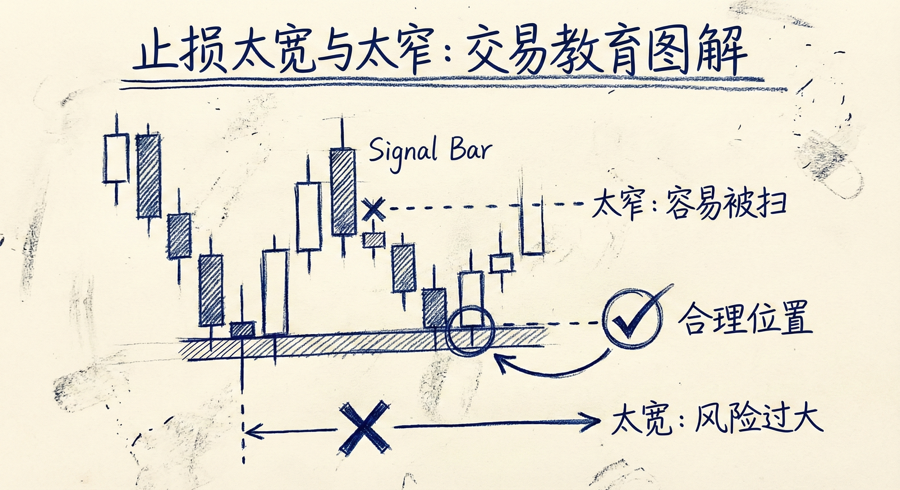
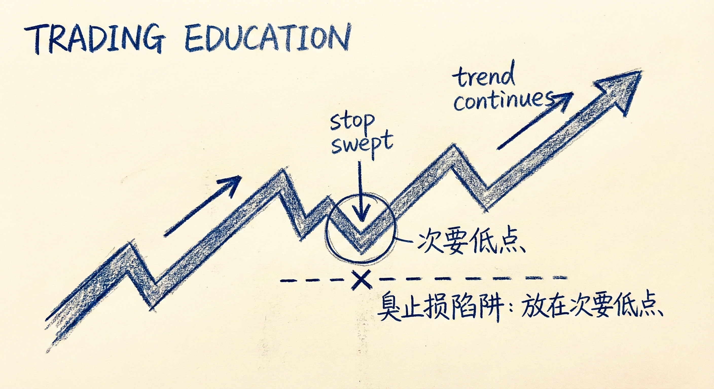
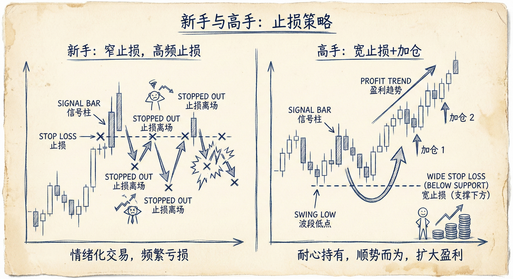
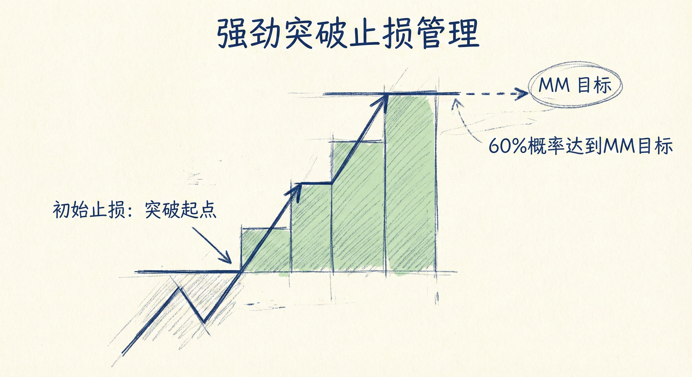

# 保护性止损（第二部分）

## 止损设置的核心原则

### 合理的止损位置
-   **避免极端**：止损太窄会导致胜率过低（容易被扫损），止损太宽会导致风险过大。
-   **基于价格行为**：止损必须放置在技术上合理的点位，例如重要的高点/低点、突破的起涨点或形态边界之外。
-   **多种选择**：每一笔交易通常有几个合理的止损位，交易者需根据自身的风险承受能力和仓位大小进行选择。

### 应对止损被触发
-   **重新评估前提**：止损被触发并不一定意味着交易逻辑失效。如果交易前提（如看跌楔形、双顶）仍然成立，应寻找再次入场的机会。
-   **再次入场策略**：
    -   **突破失败**：如果市场突破止损位后迅速反转，可能形成第2入场点。
    -   **形态重组**：例如楔形顶被突破后，可能形成更大的楔形或双顶，可在新的信号K线出现时再次入场。

## 追踪止损与"臭止损" (Stinky Stops)

### 追踪止损 (Trailing Stops)
-   **移动规则**：随着趋势发展，应将止损移动到最近的**重要低点 (Major Higher Low)** 下方。
-   **重要低点特征**：由强劲的突破产生，且创出新高。只要这些低点不被跌破，趋势假设依然有效。

### "臭止损" (Stinky Stops) 的陷阱
-   **定义**：新手因恐惧或无法承受利润回撤，将止损移动到**次要低点 (Minor Low)** 下方或震荡区间的中间位置。
-   **次要低点**：缺乏强劲买盘跟随、未创新高的回调低点。
-   **后果**：市场经常会跌破次要低点（扫损）然后恢复趋势。
-   **心理博弈**：新手在震荡区间底部因恐慌而止损（卖出），而有经验的交易者则会在该位置挂单买入。

## 新手与高手的区别

### 新手 (Novice)
-   **关注点**：过度关注单笔交易的风险金额。
-   **止损习惯**：倾向于使用极窄的止损（如信号K线下方），因为不敢承担大止损的风险。
-   **操作限制**：通常不进行加仓，一旦止损离场便停止交易。

### 高手 (Experienced Trader)
-   **关注点**：关注概率和整体期望值。
-   **止损习惯**：
    -   使用更宽的止损（如波段起点或通道起点下方），以容忍市场的随机噪音和深度回调。
    -   **调整仓位**：为了配合宽止损，会显著降低初始仓位大小。
-   **加仓策略**：愿意在价格对自身不利时（如震荡区间底部）加仓，利用"宽止损+加仓"换取更高的胜率。

## 强趋势中的止损管理

### 强力突破 (Strong Breakout)
-   **初始止损**：在强力突破的大阳线底部或突破起涨点下方。
-   **概率优势**：强力突破后，市场有约60%的概率会先达到测量目标位（Measured Move），而不是先下跌触及初始止损。
-   **深度回调**：即使出现深度回调（Deep Pullback），只要未跌破突破起涨点，市场仍可能处于上涨趋势中，或转为震荡区间，此时维持初始止损是合理的。

## 总结原则
-   **区分主次低点**：切勿将止损移动到次要低点下方，那是市场容易回踩的区域。
-   **止损与仓位匹配**：使用宽止损时必须缩小仓位；只有在止损极窄时才能重仓。
-   **克服恐惧**：不要因为回调的压力而将止损放在“马路中间”（无技术依据的位置），这通常是亏损的根源。
