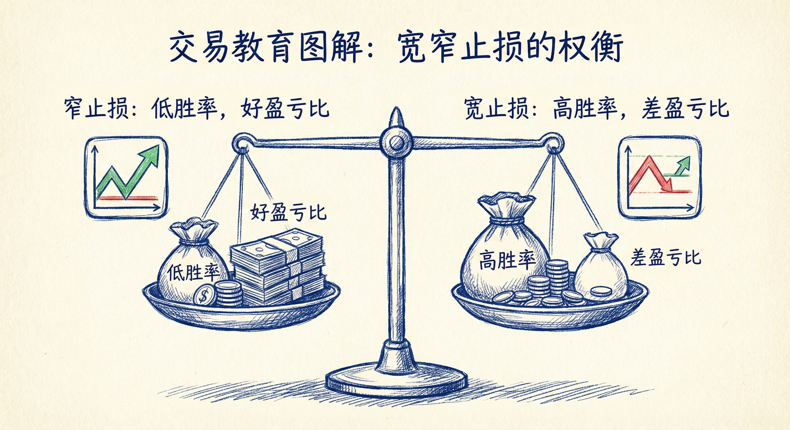
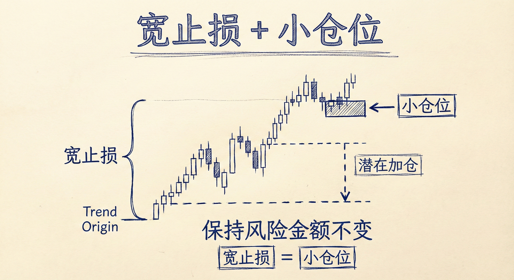

# 保护性止损（第五部分）

## 宽止损 (Wide Stops)

### 核心概念与权衡
-   **胜率与盈亏比的取舍**：
    -   **窄止损**：风险小，潜在盈亏比极佳，但胜率偏低（容易被市场噪音扫损）。
    -   **宽止损**：风险大，盈亏比相对较差，但**胜率（赚钱的概率）显著提高**。
-   **使用宽止损的逻辑**：
    -   **容错空间**：交易者不需要精确捕捉到确切的顶部或底部。
    -   **过滤噪音**：市场经常会短暂突破信号K线的高点或低点（制造陷阱），宽止损能避免在这些微小的反向运动中被清洗出局。
    -   **前提验证**：只要交易的大前提（如上涨趋势或底部反转）仍然成立，宽止损给予市场足够的时间和空间来证明交易者的判断。

### 止损设置策略
-   **基于价格行为 (Price Action)**：
    -   **趋势起涨/起跌点**：将止损放在整个波段的起点之外（例如：强阳线突破的底部、主要的高低点）。
    -   **测量运动 (Measured Move) 目标位外**：
        -   如果当前形态失败（例如楔形底被跌破），市场可能会跌到测量运动目标位。
        -   策略：将止损放在该**测量运动目标位的下方**。押注即便形态暂时失败，市场也会在到达目标位后反转，而不会继续大幅下跌。
    -   **信号K线之外**：不紧贴信号K线，而是留出额外空间（如信号K线高度的一倍距离）。
-   **基于固定数值**：
    -   **固定点数**：距离入场点固定的 ticks 或 pips（如 10, 20, 50 点，取决于周期和品种）。
    -   **波动率参考**：参考平均K线的大小或日内平均振幅（ATR）的一定比例（如10%-20%）。

### 风险管理与交易执行
-   **仓位管理 (至关重要)**：
    -   **降低仓位**：使用宽止损意味着单笔交易的潜在亏损点数增加。为了保持总风险（金额）不变，**必须显著减小交易仓位**。
    -   **加仓策略**：宽止损通常与"分批建仓/加仓"策略配合使用。如果市场先向不利方向移动（未打掉宽止损），交易者可能会在更低的位置加仓，以改善平均成本。
-   **提前离场原则**：
    -   **前提改变**：尽管设置了宽止损，但如果市场走势证明原先的交易前提已失效（例如：出现强力的反向突破并伴随跟随K线），应在收盘时手动离场，无需等待止损被触发。
    -   **止损不仅是离场点**：它更是假设失效的边界。

### 常见应用场景
-   **趋势回调**：在强趋势的回调中（如楔形牛旗），市场可能会跌破前一根K线低点。使用宽止损可避免被震出局，捕捉后续的趋势恢复。
-   **反转交易**：在捕捉顶部或底部（如头肩底、双底）时，市场常有二次探底或假突破。宽止损允许交易者承受这种波动。
-   **突破失败押注**：当押注某个突破会失败并反转时，使用宽止损防止被突破后的惯性运动扫损。

## 总结原则
-   **胜率优先**：宽止损通过牺牲部分潜在盈亏比，换取更高的交易成功率。
-   **必须缩小仓位**：这是使用宽止损的前提，确保单笔亏损在可控范围内。
-   **基于结构设置**：最好的宽止损位置通常是在关键的市场结构点位（如测量目标位、起涨点）之外，那里是多空双方攻防的极限。
