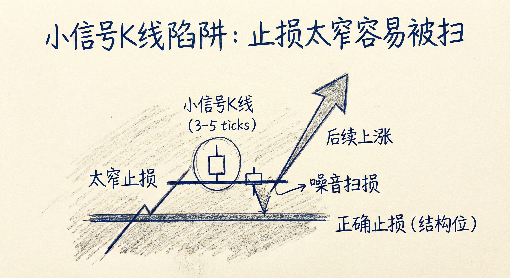
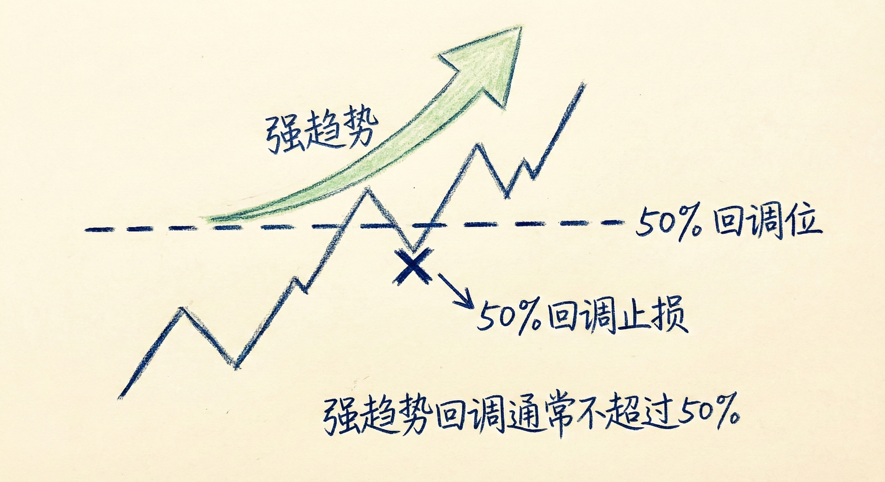

# 保护性止损设置 (第六部分)

## 小信号K线的陷阱 (Small Signal Bars)

### 定义与风险
-   **现象**：交易者发现入场机会，但信号K线体积非常小（例如仅有3-5个ticks）。
-   **常见错误**：为了追求极致的盈亏比，将止损直接设置在小信号K线的另一端（如高1买点的低点下方）。
-   **后果**：
    -   **低胜率**：风险极小通常意味着成功的概率极低。
    -   **噪音干扰**：市场稍微反向波动（噪音）就会打掉止损，随后可能按原预期方向运行。

### 交易含义
-   **避免极窄止损**：不要仅仅因为信号K线小就设置窄止损。
-   **正确做法**：即使信号K线很小，也应参考左侧的市场结构（如前一个强趋势波段的起点、关键支撑位）来设置更宽、更合理的止损。

## 基于结构和MM目标的止损 (Structural & MM Stops)

### 止损依据
-   **测量目标 (MM Targets)**：利用测量目标位（Measured Move）来判断趋势是否延续。如果价格反向突破了维持趋势成立的关键点位，说明前提失效，应止损离场。
-   **缺口与突破点**：
    -   **突破缺口**：在强趋势中，突破点与回调低点之间应保持缺口。
    -   **止损位置**：多头可将止损设在缺口下方或突破K线的低点下方。如果缺口被回补，意味着趋势转弱为震荡或反转。
-   **50% 回调位**：
    -   **原理**：强趋势的回调通常不会超过波段的50%。
    -   **策略**：多头可将止损设在上涨波段50%回调位的下方。如果跌破该位置，强趋势观点失效。

### 多周期视角
-   **时间周期转换**：小周期（如5分钟）上的"宽止损"，在更大周期（如60分钟）上可能只是一个标准的结构性止损。
-   **操作建议**：如果依据大周期的结构入场，应使用大周期的止损距离，并相应调整仓位大小。

## 宽止损与加仓 (Wide Stops & Scaling In)

### 策略逻辑
-   **容错空间**：宽止损给予交易更多的“呼吸空间”，防止因市场短暂的随机波动而被洗出局。
-   **前提条件**：
    -   **小仓位**：必须使用足够小的仓位，确保即使宽止损被触发，总亏损额度也在可控范围内（不大于平时的一笔标准亏损）。
    -   **信心**：交易者对市场方向有信心，认为当前的反向运动只是暂时的。

### 加仓操作
-   **逢低买入**：使用宽止损时，如果市场向不利方向移动但未破坏结构，交易者可在更有利的位置（如更低的支撑位、第2入场点）加仓。
-   **离场目标**：当市场回调至初始入场价附近时，第一笔仓位保本，加仓部分获利，整体实现盈利。

## 风险、回报与概率 (Risk, Reward, Probability)

### 交易的不可能三角
-   **高胜率 vs. 好盈亏比**：
    -   **强趋势突破**：胜率高，但止损通常很远（风险大），导致盈亏比不佳。
    -   **小止损博弈**：风险小（盈亏比好），但很容易被止损（胜率低）。
-   **权衡**：交易者必须在胜率和盈亏比之间做出选择。如果你选择高胜率的入场点（如突破后追涨），就必须接受较宽的止损和较差的盈亏比。

### 替代方案：期权
-   **应用场景**：在日线等大周期图表上，如果结构性止损距离过大，导致风险无法承受。
-   **策略**：使用买入看跌/看涨期权（Put/Call）或价差策略（Spreads）替代直接持有股票/期货。
-   **优势**：期权将最大亏损锁定在权利金范围内，即使市场大幅波动也能持有头寸。

## 总结原则
-   **止损位置由市场结构决定**：不要仅依据信号K线的大小设置止损，要寻找前期低点、缺口、50%回调位或MM目标位作为依托。
-   **仓位管理是核心**：使用宽止损时，必须缩小仓位，确保单笔风险金额恒定。
-   **理解概率与风险的关系**：接受“小风险=低胜率”和“高胜率=大风险（宽止损）”的市场规律。
-   **坚决执行**：一旦设定的合理止损（前提失效点）被触及，必须离场，不要抱有幻想。
