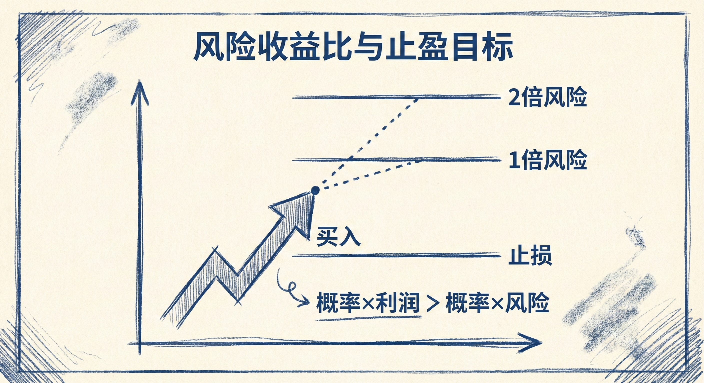

# 实际风险（第一部分）

## 数学期望 (Trader's Equation)

### 定义与核心逻辑
-   **概念**：交易决策必须基于正的数学期望，即（成功概率 × 潜在利润）必须大于（失败概率 × 风险）。
-   **交易准则**：只有当数学期望大于0时，才应当进行交易。
-   **胜率与盈亏比**：
    -   **高胜率交易 (≥60%)**：通常利润空间较小，追求 1倍 风险的回报是合理的。
    -   **普通胜率交易 (40%-60%)**：由于不确定性较高，必须追求至少 **2倍** 于风险的利润，以确保数学期望为正。

## 初始风险 vs. 实际风险

### 初始风险 (Initial Risk)
-   **定义**：从入场价格到初始止损位置的距离。
-   **主观性**：取决于交易者的个人选择，不同交易者的初始风险不同。
    -   **价格行为止损**：如信号K线下方、突破点下方、或趋势起涨点下方。
    -   **资金管理止损**：如固定点数（ticks/pips）或固定金额。
    -   **测量目标止损**：如根据测量目标位翻倍后的位置。

### 实际风险 (Actual Risk)
-   **定义**：从入场价格到"完美止损"位置的距离。
    -   **完美止损**：事后来看，为了不被扫地出局所必须设置的最小止损距离（即回调的最低点）。
-   **特征**：
    -   **滞后性**：在开仓时无法预知，只有当市场向有利方向强势突破后，回过头看才能确定。
    -   **客观性**：无论交易者的初始止损设在哪里，对于同一笔成功的交易，实际风险（最大浮亏）是固定的。
    -   **通常小于初始风险**：只要初始止损未被触发，实际风险通常小于或等于初始风险。

## 利润目标与交易管理

### 基于风险设定目标
-   **1倍实际风险**：
    -   适用于 **高胜率** 交易（如强趋势中的旗形）。
    -   许多电脑程序（Algos）会根据实际风险设定止盈目标，导致价格在到达 1倍实际风险处出现回调。
-   **2倍风险（初始或实际）**：
    -   适用于大多数交易（胜率不确定时）。
    -   追求 2倍 风险的利润在数学上总是合理的，能保证长期正期望。
    -   由于初始风险通常大于实际风险，若以 2倍初始风险为止盈，数学期望会更好。

### 市场行为启示
-   **目标位即阻力/支撑**：
    -   上涨趋势中，多头的止盈卖单和空头的做空卖单会在目标位汇聚，形成阻力。
    -   下跌趋势中，空头的回补买单和多头的做多买单会在目标位汇聚，形成支撑。
-   **提前离场**：如果市场未达到目标位但出现反转形态（如双顶、楔形顶、连续强反向K线），且交易前提（如强趋势）不再成立，应果断提前离场。

## 总结原则
-   **区分两种风险**：理解初始风险是主观设定的保护，而实际风险是市场客观造成的最大回撤。
-   **利用实际风险止盈**：在强趋势或高胜率形态中，关注 1倍实际风险处的价格反应；在常规交易中，瞄准 2倍风险。
-   **数学期望至上**：始终确保（概率×利润 > 概率×风险），若无法确定高胜率，则必须争取高盈亏比。
