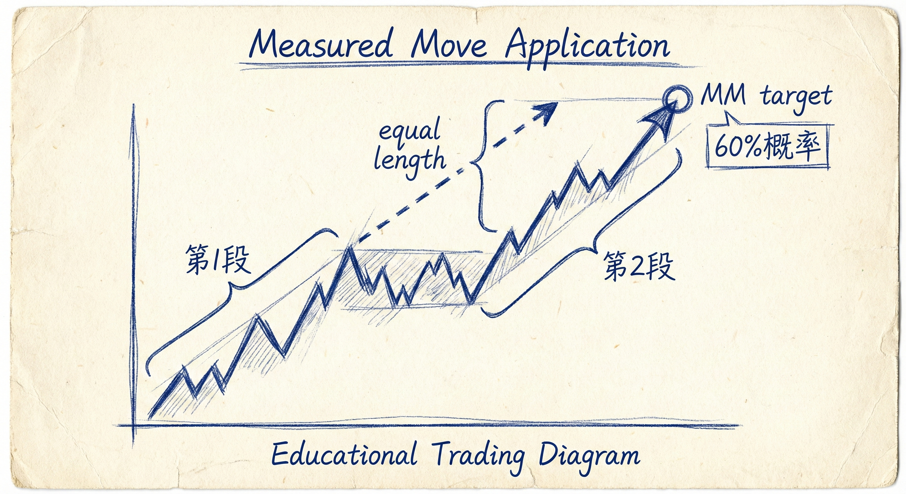

# 实际风险与利润目标（第二部分）

## 实际风险与止盈设定

### 基本原则
-   **正数学期望**：交易的核心是维持正的数学期望。通常情况下，默认的利润目标应至少是**实际风险的两倍**。
-   **实际风险定义**：指入场点与价格往有利方向运行前所触及的最不利点位之间的距离。在强趋势中，实际风险往往很小。

### 高胜率交易的特例
-   **一倍实际风险**：在极高胜率的交易机会中（如强势突破期间），将目标设定为**一倍实际风险**也是合理的。
-   **前提条件**：该利润目标必须满足剥头皮交易的最小获利规模（如外汇的10 pips或期货的4 ticks）。

## "最低要求" vs "最佳选择"

### 局限性
-   **仅是及格线**：利用实际风险计算出的止盈位，仅仅是数学上合理的**最低要求**（Minimum Requirement）。
-   **非最优解**：最低要求往往不是最佳选择。就像学生以全D成绩毕业虽然符合最低要求，但并非理想结果。

### 更好的止盈策略
-   **忽略微小风险**：当实际风险非常小，但市场爆发力很强时，不应受限于两倍实际风险的微小目标。
-   **利用市场结构**：应结合**测量运动（Measured Moves）**、趋势线、前期重要高低点或支撑阻力位来设定更远大的目标。

## 测量运动 (Measured Moves) 的应用

### 概率优势
-   **60% 概率**：在强势突破中，市场有约60%的概率会达到测量运动目标（通常是突破幅度的翻倍）。
-   **持有逻辑**：既然有高概率到达更远的目标（MM），在仅赚取两倍微小实际风险时离场是不理性的。

### 风险管理
-   **止损调整**：随着价格向目标位移动，交易者应移动止损（如移至突破点下方）或减仓，以降低利润回撤的风险。
-   **机构行为**：价格在测量目标位附近的停顿或回调，通常是机构算法程序在进行止盈操作。

## 统计思维与样本误差

### 避免以偏概全
-   **异常值 (Outliers)**：不要因为单笔交易的极端亏损（如冒大风险赚小钱却失败）或极端盈利而否定或盲信一个策略。
-   **样本误差**：个别极端的交易案例无法代表整体表现。
-   **长期视角**：评估策略的有效性必须基于大量样本（如100笔交易）。只要策略在数学上具有正期望值，长期来看就能实现总体盈利。

## 总结原则
-   **目标设定**：普通交易追求2倍实际风险，高胜率交易可接受1倍实际风险。
-   **顺势而为**：在强趋势中，不要过早止盈，应追求基于市场结构的更大目标（如MM）。
-   **概率思维**：通过控制风险（止损）和利润（止盈），确保在大样本下实现正的数学期望。
