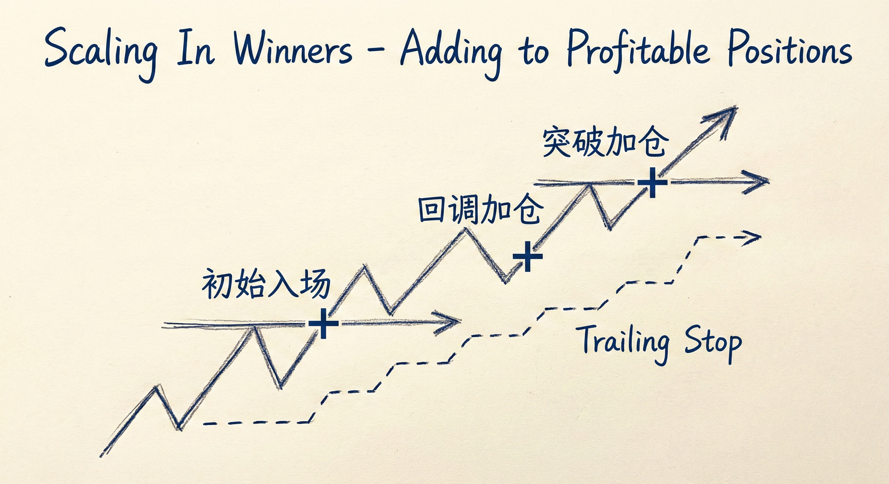
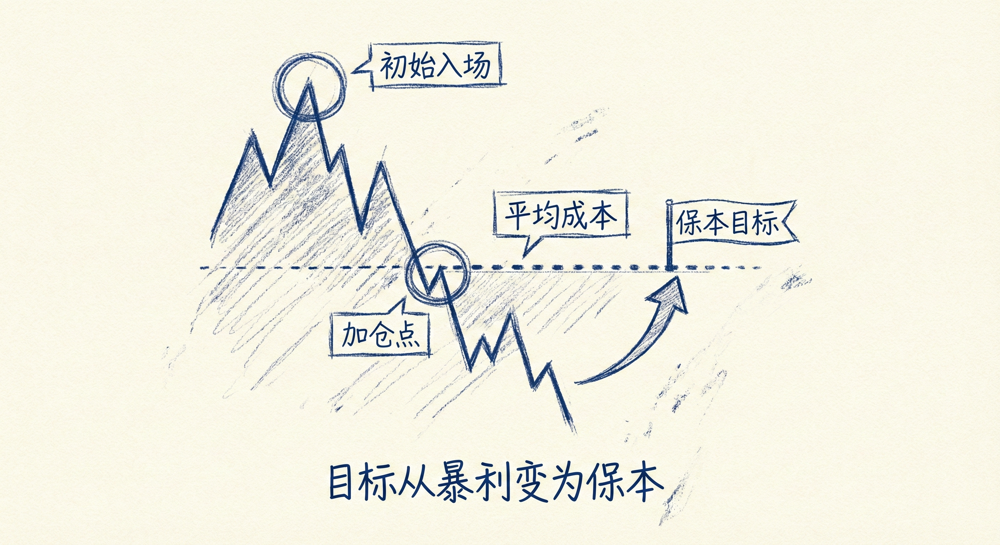

# 加仓策略基础与实战（第一部分）

## 加仓的核心逻辑与心理 (Core Logic & Psychology)

### 定义与适用人群
-   **适用者**：职业交易者（如机构、基金经理）、经验丰富的交易者。
-   **前提条件**：建议在实现稳定盈利后才尝试加仓，新手应谨慎。
-   **核心权衡**：
    -   **优势**：加仓可以显著提高交易的**胜率**（Winning Rate）。
    -   **代价**：为了提高胜率，必须牺牲**盈亏比**，同时承担更大的**风险**（Risk）。

### 心理建设与仓位管理
-   **“不在乎”的仓位**：加仓时必须使用极小的初始仓位，小到交易者“不在乎”其波动。
-   **保持客观**：只有当金钱压力极小时，交易者才能根据K线图做出客观、正确的决定，而不是被账户盈亏左右。
-   **新手陷阱**：新手往往因情绪化、仓位过大或缺乏耐心（加仓过早），导致在浮亏加仓时遭受巨大损失。

## 盈利加仓 (Scaling In Winners)

### 场景与执行
-   **场景**：强趋势行情（如连续阳线突破）。
-   **入场点**：
    -   **突破买入**：在强势突破K线或创新高时买入。
    -   **回调买入**：在趋势中的小回调（如牛旗、高1/高2）结束恢复趋势时买入。
-   **间隔原则**：加仓点之间应至少保持一个剥头皮（Scalp）的距离，避免在同一价格密集加仓。

### 风险控制与离场
-   **移动止损**：随着趋势发展，将止损上移至新的起涨点或关键低点下方。
-   **离场信号**：
    -   **动能衰竭**：当强趋势转变为震荡区间或通道（如出现重叠K线、十字星、动能减弱）时，应减仓或离场。
    -   **高潮形态**：趋势后期（通常超过20根K线）出现极大的加速K线，往往是**竭尽型缺口**（Exhaustion Gap），预示趋势即将结束，是止盈良机。

## 亏损加仓 (Scaling In Losers)

### 逻辑与目标
-   **前提**：交易的原始前提（如宽通道趋势）仍然有效，仅仅是入场时机稍早。
-   **目标转变**：亏损加仓后，交易目标通常从“获取暴利”转变为“打平离场”或“小赚离场”。
-   **胜率提升机制**：通过在更优价格加仓，拉低平均持仓成本。只需价格回调至平均成本线即可保本，无需回到初始入场点。

### 交易策略
-   **入场时机**：
    -   在合理的支撑位、信号K线（如双底、楔形底）或关键均线处加仓。
    -   等待市场出现反转迹象（如强阳线）再加仓。
-   **离场策略**：
    -   **打平离场**：在平均入场价格挂限价单，整体保本出局。
    -   **部分盈利**：在初始入场价离场（第一笔保本，第二笔盈利）。
-   **风险警示**：仓位翻倍意味着风险剧增。必须设置宽止损，且总风险不能超过单笔标准交易的风险承受限度。

## 机构与散户的加仓案例

### 机构投资者
-   **价值投资**：如巴菲特和卡尔·伊坎（Carl Icahn）。
-   **操作手法**：在看好的资产价格下跌时不断买入（亏损加仓），坚信资产被低估，最终通过长期持有获利。

### 散户投资者
-   **定投 (Dollar Cost Averaging)**：定期定额投资（如每月买入股票）。
-   **优势**：平摊成本，避免择时风险（买在最高点），利用市场波动在低位积累更多筹码。

## 总结原则
-   **胜率与风险的交换**：加仓是用更高的风险换取更高的胜率，天下没有免费的午餐。
-   **前提必须成立**：无论是盈利还是亏损加仓，前提必须是原有的趋势判断依然有效。一旦前提破坏（如趋势反转），必须坚决离场。
-   **识别趋势末端**：警惕趋势持续20根K线后的加速大阳/大阴线，这通常是诱多/诱空的高潮，而非新的突破，应利用此机会止盈而非追涨杀跌。
