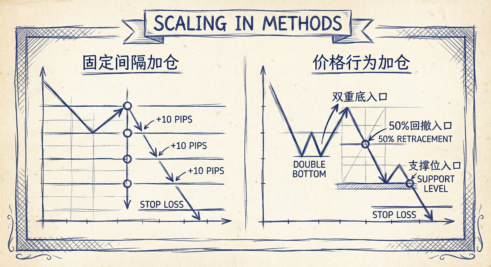
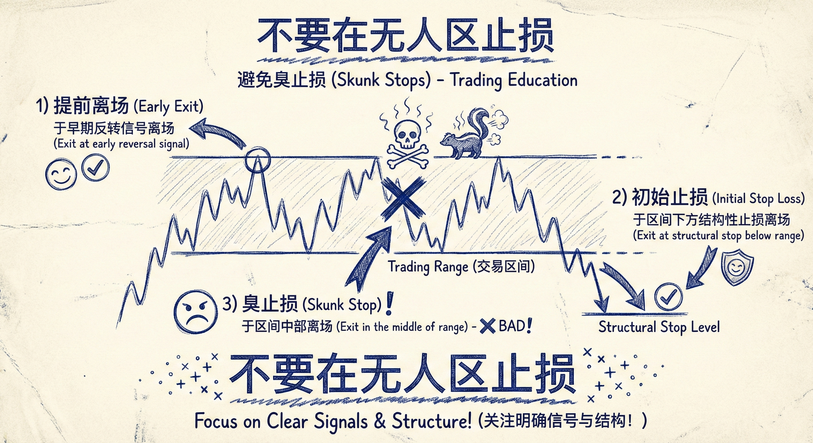

# 浮亏加仓策略 (Scaling In)

## 定义与执行方法

### 概念与前提
-   **核心概念**：在入场后市场反向移动（出现浮亏），但原有交易前提（如上涨趋势）仍然有效时，通过增加仓位来管理交易。
-   **前提条件**：必须确信市场趋势未变，且未跌破关键支撑/阻力位（如前期重要低点）。

### 加仓方式
-   **固定间隔加仓**：
    -   按固定点数/点差加仓（例如：ES每跌1个点，外汇每跌10 pips）。
-   **价格行为结构加仓**：
    -   **比例回调**：在50%回调处加仓。
    -   **K线形态**：在双底、双K反转、或强阳线收盘上方加仓。
    -   **支撑位**：在前期重要低点附近加仓。

## 交易目标与离场策略

### 离场逻辑
-   **最低目标（保本）**：在初始入场价与加仓价的**中间点**离场。此时初始仓位亏损与加仓仓位盈利抵消，总体保本。
-   **常见目标（微利）**：在**初始入场价**离场。此时初始仓位打平，加仓部分获得利润。
-   **失望离场**：如果回调过深或持续时间过长（演变为震荡区间），交易者可能会在总体打平或微利时全部离场，不再追求原定的趋势目标。

### 加仓距离要求
-   **最小距离**：加仓点与初始入场点的距离，至少应等于一个剥头皮（Scalp）的最小利润目标（如ES 1个点，外汇 10 pips）。
-   **理想距离**：最好是剥头皮目标的2-3倍，或止损距离的1/3。

## 仓位管理的核心规则

### 宽止损与小仓位
-   **宽止损**：浮亏加仓必须配合宽止损（通常放在趋势起点的下方），止损距离可能达到平时的2-3倍。
-   **仓位缩减**：
    -   **反比原则**：如果止损距离是平时的3倍，仓位必须缩减至平时的1/3。
    -   **总风险控制**：所有仓位（初始+加仓）的总风险不能超过单笔交易的允许风险额度。
-   **小账户警示**：如果账户资金无法支持在缩减仓位后仍满足最小合约要求，则**不应**进行此类交易。

## 避免“臭止损” (Skunk Stops)

### 什么是“臭止损”
-   **定义**：既没有在反转信号初现时“提前离场”，也没有坚持到“初始止损”被触发，而是在回调中途（通常是震荡区间的底部）因恐慌而止损。
-   **危害**：这种做法通常发生在次要低点附近，正是机构买入的地方，属于低胜率的恐慌性抛售。

### 正确的止损逻辑
-   **要么早走**：看到强反转信号（如大阴线）立刻离场。
-   **要么死扛**：依赖基于市场结构的宽止损（初始止损）。
-   **拒绝中间态**：不要在"无人区"或震荡区间底部随意止损。

## 总结原则
-   **计划先行**：每一笔加仓交易前都必须有明确的计划，确认前提有效。
-   **数学合理性**：通过在更低位置买入，降低了整体盈亏平衡点，提高了全身而退的概率。
-   **严格风控**：浮亏加仓成功的关键在于**极小的初始仓位**和**正确的宽止损**，而非盲目补仓。
