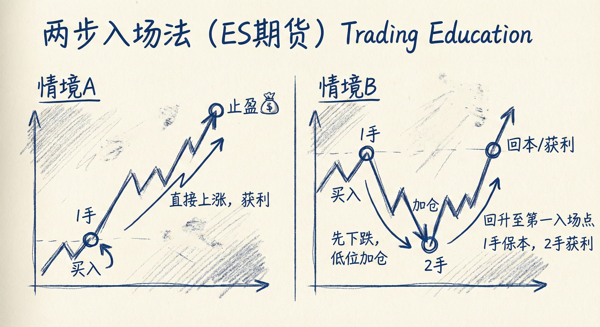
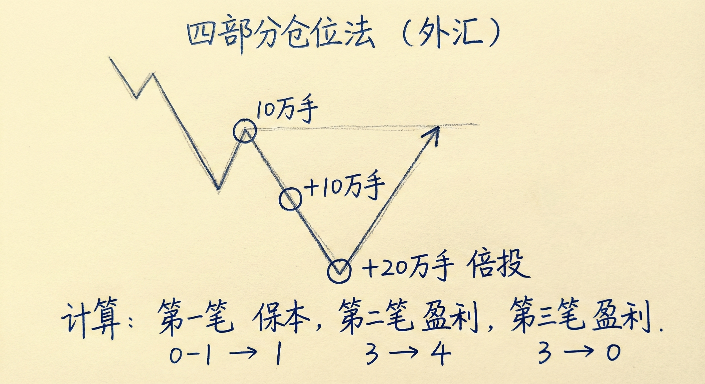

# 加仓策略实战案例（第三部分）

## 策略一：两步入场法 (以 ES 期货为例)

### 策略结构
-   **基本设定**：假设总资金允许交易2手合约，将其分为两次入场。
-   **初始入场**：在趋势中（如强上涨趋势或双底牛旗上方）买入1手合约。
-   **加仓计划**：
    -   **触发条件**：只有当市场反向移动（如回调至少1个点）时才加仓。
    -   **位置**：在初始入场下方固定距离（如1个点）或技术位（如高2信号）买入第2手合约。
    -   **止损**：设置在较远的结构性低点（如双底下方），需承担较大止损距离。

### 交易情境与管理
-   **情境 A：市场直接上涨（无回调）**
    -   **操作**：仅持有初始的1手合约。
    -   **结果**：快速达到剥头皮目标（如1个点）止盈。无需加仓，直接获利。
-   **情境 B：市场回调（被套）**
    -   **操作**：在预定位置买入第2手合约。
    -   **目标**：通常设定在初始入场价格附近。
    -   **结果**：初始仓位打平，加仓部分获利（例如加仓部分赚1个点）。
-   **逻辑**：在强趋势中，即使买在最高点（追涨），该价格通常也是未来的"磁铁"，市场大概率会再次测试该价格，允许交易者全身而退。

## 策略二：四分仓位法 (以 外汇 为例)

### 策略结构
-   **资金分配**：将总仓位（例如40万手）分为4等份，分3次入场。
-   **入场步骤**：
    1.  **第1次入场**：买入 1/4 仓位（10万手）。
    2.  **第2次入场**：价格下跌一定距离（如10 pips）后，加仓 1/4 仓位（10万手）。
    3.  **第3次入场**：价格继续下跌或出现信号K线时，加仓 2/4 仓位（20万手，即**倍投**）。
-   **止损设置**：基于大周期的结构性低点，距离非常远。

### 交易管理与数学期望
-   **离场目标**：通常设定在**初始入场价格**全部离场。
-   **盈亏计算**：
    -   初始仓位（10万）：打平 (Breakeven)。
    -   第1次加仓（10万）：盈利（如10 pips）。
    -   第2次加仓（20万）：盈利更多（如18 pips × 2）。
-   **核心优势**：通过在低位加大仓位（倍投），即使反弹幅度不大（仅回到初始入场点），也能获得可观的总利润。
-   **适用场景**：震荡区间或趋势回调深幅时，交易者对趋势延续信心下降，转而寻求保本或小赚离场。

## 加仓的数学逻辑与风险管理

### 胜率与盈亏比的权衡
-   **高胜率代价**：加仓策略极大地提高了胜率（几乎总能全身而退），但牺牲了盈亏比。
-   **风险不对称**：初始风险可能是潜在利润的8倍甚至更多。
-   **职业交易者的调整**：
    -   **提前止损**：不会死板地等待止损被打掉，一旦前提失效（如跌破关键低点）立即离场。
    -   **波段持有**：有时会保留部分仓位进行波段交易，用大利润弥补糟糕的初始盈亏比。

### 什么时候应该离场？
-   **预期改变**：如果回调时间过长或幅度过深，市场从“强趋势”转变为“震荡区间”或“弱趋势”。
-   **目标调整**：
    -   **失望离场**：对趋势强度感到失望时，不再追求新高，而是在初始入场价或反弹高点离场。
    -   **打平策略**：在两个入场点的中间价位挂单，确保整体不亏损。

## 总结原则
-   **仓位控制是核心**：想要使用宽止损和加仓策略，**初始仓位必须非常小**（建议为舒适仓位的1/2甚至1/4）。新手亏损的主因是仓位过大，无法承受回调时的心理压力。
-   **理解三变量**：交易是风险、利润和概率的平衡。加仓是利用高风险（宽止损）换取高概率。
-   **仅限老手**：新手往往只关注风险（恐惧）而忽视概率，且缺乏处理复杂仓位管理的经验，不建议使用加仓策略。
-   **灵活性**：加仓位置可以是固定的点数距离，也可以是技术形态（如H2/L2、双底、均线），关键在于逻辑一致。
