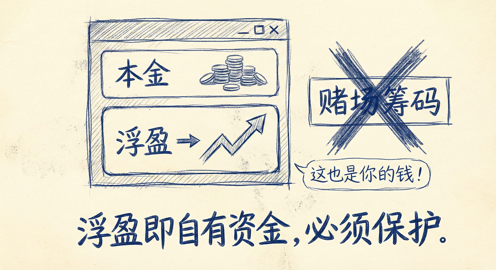
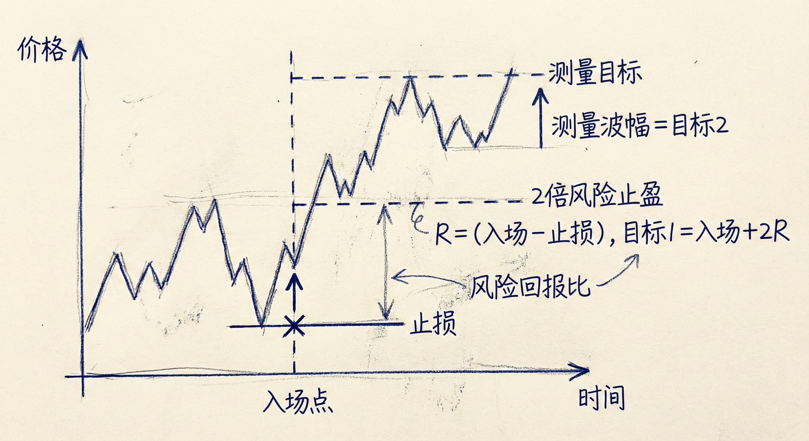

# 交易管理与止盈（第一部分）

## 交易管理的核心定义

### 定义与原则
-   **概念**：交易管理是指**入场之后**的所有操作。
-   **核心逻辑**：
    -   **遵循计划**：如果价格行为符合预期，坚持原定交易计划。
    -   **前提失效即离场**：如果入场理由（前提）不再成立（例如预期突破却遭遇强反转），必须改变计划并准备离场，哪怕是亏损。
-   **数学期望**：所有决策应基于正的数学期望，即 `(胜率 × 潜在利润) > (失败概率 × 风险)`。

## OPM (Other People's Money) 误区

### 错误观念与真相
-   **OPM 谬论**：许多交易者认为浮盈"还不是自己的钱"，或者是"赚来的钱（House Money）"，因此可以随意冒险或容忍大幅回撤。
-   **正确心态**：
    -   **浮盈即自有资金**：只要钱显示在账户余额里（包括未平仓利润），那就是**你的钱**，必须像对待本金一样严格保护。
    -   **浮亏即他人资金**：一旦出现浮亏，那部分钱实际上已经转移到了对手的账户中，你不再拥有控制权。
-   **管理无关性**：交易管理只取决于当前的**价格行为**、**止损位**和**目标位**，与你的**入场价格**无关。

## 止损设置与调整

### 初始止损
-   **位置选择**：不应随意放置，而应基于市场结构。例如在多头趋势中，止损应放在突破起涨点或重要低点下方。
-   **实际风险**：基于技术位的止损距离决定了仓位大小和实际风险。

### 移动止损与打平止损
-   **移动原则**：不要过早移动止损。只有当市场建立了新的重要支撑/阻力（如新的强突破形成更高低点）后，才移动止损以减少风险。
-   **打平止损 (Breakeven) 的陷阱**：
    -   **剥头皮者的错误**：许多交易者因市场未达目标感到“失望”，便将止损移至入场价（打平）。
    -   **数学不合理性**：除非技术形态支持，否则单纯为了“不亏钱”而移动止损在数学上是错误的，往往会被扫损后看着市场朝原方向运行。

## 止盈策略

### 目标位设定
-   **测量目标 (Measured Moves)**：利用缺口、突破幅度或“第一段=第二段”来预测目标位。
-   **机构行为**：机构通常会在这些目标位减仓或止盈，导致市场回调。

### 2倍风险法则
-   **高胜率策略**：在**2倍初始风险**（2x Initial Risk）处止盈。
-   **数学优势**：如果你总是坚持在2倍风险处止盈，即使胜率只有40%，长期来看也能盈利。

## 交易心理与总结

### 面对亏损
-   **向前看**：不要纠结于上一笔交易的亏损。沉溺于过去会让你错过当下极佳的入场机会（如末端旗形反转）。
-   **接受现实**：亏损是交易的一部分，即使是胜率90%的交易者也会亏损。

### 总结原则
-   **保护利润**：像守护本金一样守护浮盈，拒绝 OPM 思维。
-   **依据前提离场**：当市场证明你的交易前提错误时（如强反转信号），无论盈亏，立即离场。
-   **合理止盈**：利用数学期望（如2倍风险）和技术目标位进行止盈，而非情绪化操作。
