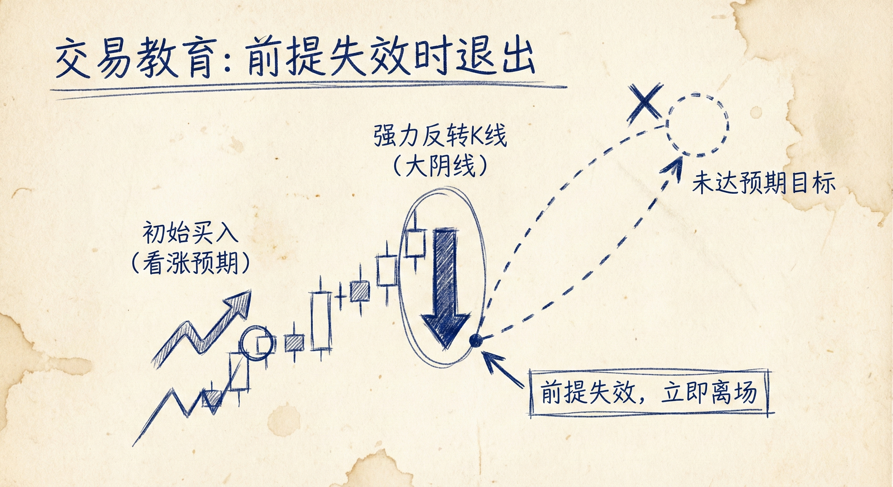
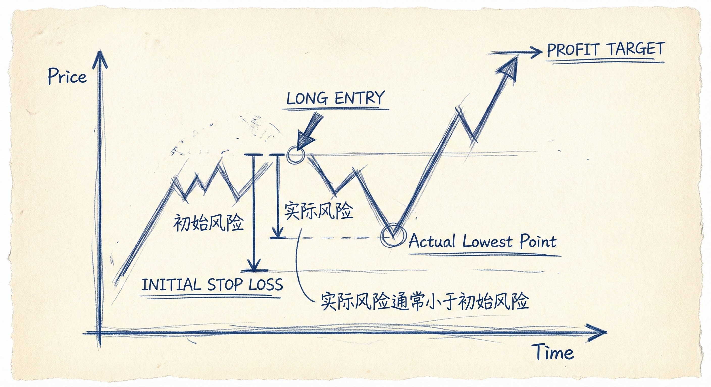

# 交易管理与止盈（默认标准）

## 止盈的默认标准与前提失效

### 定义与识别
-   **MM目标位 (Measured Move)**：基于前一段趋势或突破高度设定的合理利润目标（如第1段=第2段，或突破高度翻倍）。
-   **前提失效**：当市场在未达到预定目标位之前，出现了强势的反转信号。
-   **特征**：
    -   **强势反转**：出现强力的反向K线或突破结构。
    -   **概率改变**：原本到达MM目标位的概率显著降低，交易的假设前提不再成立。

### 交易含义
-   **立即离场**：一旦看到强势反转且反向突破订单被触发，不要期待目标最终会达到，应立即离场。
-   **跟随主力**：强势反转往往发生在潜在的末端旗形处，意味着反向力量（如多头在熊旗底部）介入，顺势交易者应跟随离场。

## 初始风险 vs. 实际风险 (Initial vs. Actual Risk)

### 定义与区别
-   **初始风险**：入场点到初始止损点（通常在信号K线或波段高低点之外）的距离。
-   **实际风险**：入场后价格反向运行的最大距离。在强趋势或强突破中，实际风险往往非常小（可能仅几个ticks/pips）。

### 止盈策略计算
-   **1倍实际风险**：
    -   **数学逻辑**：在高胜率（60%+）的强突破交易中，1倍盈亏比在数学期望上是盈利的。
    -   **局限性**：如果实际风险极小（如2 ticks），只赚1倍利润是不明智的，且可能低于剥头皮的最低门槛（如外汇通常需大于10 pips）。
-   **2倍实际风险**：数学上合理的最低止盈目标。
-   **2倍初始风险**：
    -   **推荐做法**：当实际风险很小时，不应受限于实际风险倍数，而应将"2倍初始风险"作为止盈目标，以获取更合理的利润。
-   **分批止盈**：可在2倍风险（实际或初始）处止盈一半，剩余仓位持有至趋势结束。

## 数学合理性 vs. 最佳选择

### 为什么“数学上合理”还不够？
-   **最低要求不是最佳目标**：虽然1倍实际风险能产生正期望值，但在强趋势（如连续6根阳线）中，过早离场会错失主要利润。
-   **结合背景 (Context)**：如果背景显示趋势极强，应忽略微小的实际风险倍数，持有仓位直到出现反转信号或达到基于初始风险的大目标。
-   **避免“捡芝麻”**：即使数学公式成立，如果利润绝对值太小，也不应作为目标。

## 交易启示与心态

### 离场信号的识别
-   **趋势末端迹象**：关注趋势后期的超大K线（可能是竭尽缺口）、末端旗形或长时间的窄震荡区间。
-   **概率回归50%**：当趋势演变为长时间震荡（如20+根K线），延续趋势的概率降至50%左右，此时应考虑全额离场。

### 交易者的“神奇数字”
-   **日赚$5,000**：这是许多交易者的心理里程碑。
-   **逻辑**：日均$5,000 × 200个交易日 = 年入100万美元。
-   **进阶之路**：从日赚$1,000 -> $2,000 -> 最终目标$5,000，通过增加仓位而非过度交易来实现。

## 总结原则
-   **前提失效即离场**：未达目标即遇强反转，不要抱有幻想，立即止盈/止损。
-   **区分两种风险**：利用“实际风险”确认交易的数学安全性，利用“初始风险”设定更佳的获利目标。
-   **不要只做最低限度**：当市场给予强趋势时，不要满足于微薄的数学期望，要追求与其强度匹配的利润。
